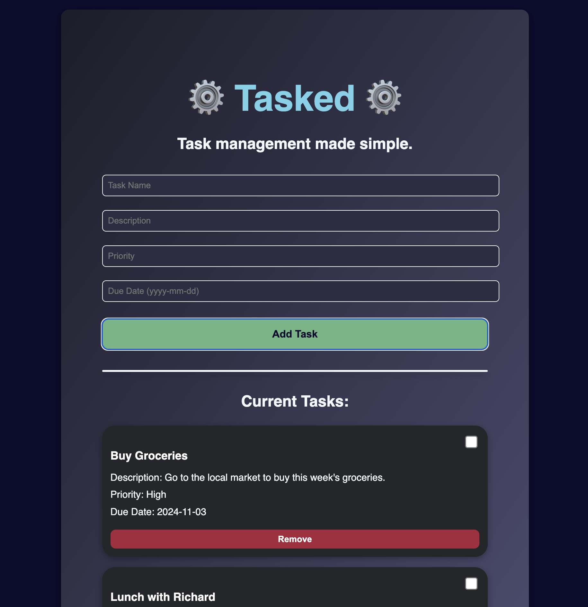

# Tasked

Task management made simple.

*Preview:*



## Deployment (Locally via Docker Compose)

Install git, Docker, and Docker Compose to your machine. Clone this repository then change directory to root of the project.

Linux (Ubuntu), macOS:

```bash
docker compose up --build -d
```

The application should be available as follows:

<http://localhost> / <http://localhost:80>  - Main application UI (React Frontend)

<http://localhost:8000> - FastAPI Backend (<http://localhost/docs:8000> for Swagger UI)

localhost:5432 / postgres:5342 - Postgres DB
